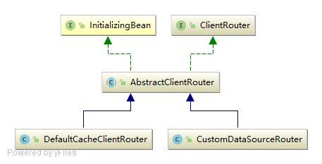

#路由选择器简介：
    主要处理动态client路由问题,类结构图如下：
     
#路由器工程结构：
  router-parent :父工程
   |
   router-core : 基础包
        |
        router-nosql ：nosql路由选择器
        |
        router-database ：database路由选择器
        
        
        
#router-nosql spring配置：
     <bean id="cl01" class="com.al.crm.router.nosql.extend.RedisClusterCache">
        <constructor-arg>
            <props>
                <prop key="redis.url">${cacheCluster_1.redis.url}</prop>
                <prop key="redis.maxActive">${cacheCluster_1.redis.maxActive}</prop>
                <prop key="redis.maxIdle">${cacheCluster_1.redis.maxIdle}</prop>
                <prop key="redis.minIdle">${cacheCluster_1.redis.minIdle}</prop>
            </props>
        </constructor-arg>
     </bean>
      

    <bean id="provRedisCluster" class="com.al.crm.router.nosql.DefaultRedisFixProxy">
               <constructor-arg name="clientRouter" ref="routeSelector"/>
           </bean>
       
           <!--nosql路由配置   -->
           <bean id="routeSelector" class="com.al.crm.router.nosql.DefaultCacheClientRouter">
               <property name="targetClientInstanceBeans">
                   <map>
                       <entry key="rds01" value-ref="cl01" />
                       <entry key="rds02" value-ref="cl02" />
                       <!--<entry key="rds03" value-ref="cl03" />-->
                   </map>
               </property>
               <property name="strategy" value="com.al.crm.router.core.strategy.DefaultRegionRouteStrategy"/>
           </bean>
        
_cl01/cl02 为对应的IRedisFix 实现类实例_

#router-database spring 配置：
    <bean id="dataSource2" class="com.mchange.v2.c3p0.ComboPooledDataSource"
        destroy-method="close">
        <property name="driverClass" value="${driverClass}"></property>
        <property name="jdbcUrl" value="${crmZCDatabase}"></property>
        <property name="user" value="${crmZCAppUser}"></property>
        <property name="password" value="${crmZCAppUserPwd}"></property>
        <property name="acquireIncrement" value="${acquireIncrement}"></property>
        <property name="maxIdleTime" value="${maxIdleTime}"></property>
        <property name="initialPoolSize" value="${initialPoolSize}"></property>
        <property name="maxPoolSize" value="${maxPoolSize}"></property>
        <property name="minPoolSize" value="${minPoolSize}"></property>
        <property name="maxStatements" value="${maxStatements}"></property>
        <property name="maxStatementsPerConnection" value="${maxStatementsPerConnection}"></property>
    </bean>    
    
	<bean id="dataSource" class="com.al.crm.router.database.SpringDataSourceRouter">
		<property name="targetDataSources">
			<map>
				<entry key="ds01" value-ref="dataSource2"/>
				<entry key="ds02" value-ref="dataSource2"/>
			</map>
		</property>
		<property name="strategy" value="com.al.crm.router.core.strategy.DefaultRegionRouteStrategy"/>
	</bean>
	
#路由器使用时配置路由表，即RouteId-targetDataSources.key 对应关系,如下：
    com.al.crm.router.core.MDA.REGION_ROUTE_MAP
    类型为：Map<String, Map<String, String>>	
    key 设置为 系统名称,需要在properties文件中设置uniconfig.domain=系统名称;
    简要配置如下：
            Map<String,String> map = new HashMap<String, String>();
            map.put("areaId_111","ds01");
            map.put("areaId_222","ds02");
            map.put("areaId_333","ds01");
            MDA.REGION_ROUTE_MAP.put("CRM2013",map);
	
#路由器使用时需要设置线程级变量,用完需要清除：
    RouteContext.setRouteId(routeId);
    RouteContext.clear;
    
